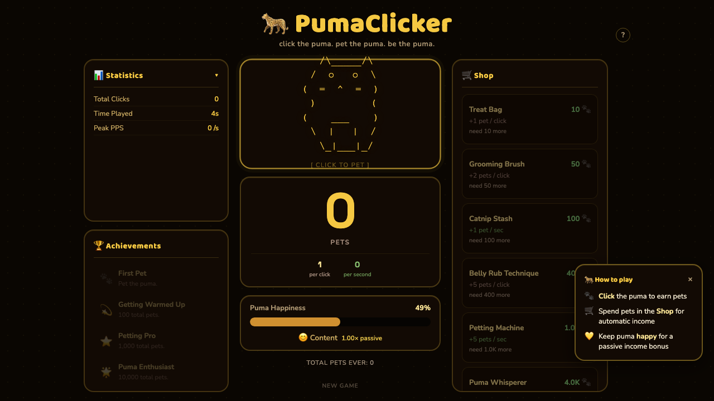
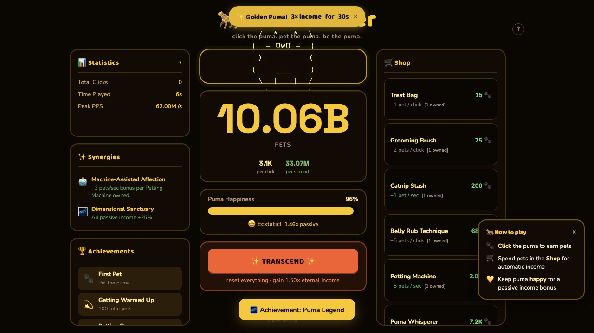
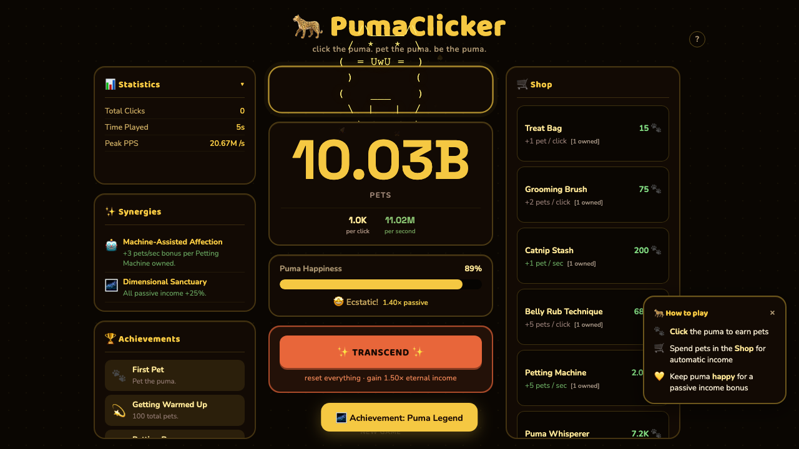

# PumaClicker

A browser-based idle clicker game. Click the puma. Earn pets. Build an empire of affection.

## Play

Open `PumaClicker.html` in any modern browser. No server, no build step, no dependencies.

## How to Play

**Click** the puma to earn pets. **Spend** pets in the Shop to unlock upgrades that boost your click power and passive income. The puma earns pets for you automatically — even when you're not clicking.

### Happiness

Your puma has feelings. Its happiness naturally drifts toward 50% over time, and its mood changes across five states: Grumpy, Calm, Content, Happy, and Ecstatic — each with its own ASCII art expression. Happiness directly scales your **passive income** (0.5x at 0%, 1.0x at 50%, 1.5x at 100%). Click income is always full value. The live multiplier is shown next to the puma's mood.

### Shop

14 upgrades ranging from a Treat Bag (10 pets, +1 pet/click) to Puma God Mode (10 billion pets, +10M pets/sec). Each purchase increases the cost of the next, so timing matters. Upgrades boost either click power or passive income — progress bars show how close you are to affording each one.

### Synergies

Owning the right combination of upgrades unlocks synergy bonuses:

- **Relaxed Grooming** — 3x Grooming Brush + 2x Catnip Stash: happiness decays 50% slower
- **Machine-Assisted Affection** — Petting Machine + Puma Whisperer: +3 pets/sec per Petting Machine owned
- **Dimensional Sanctuary** — Puma Sanctuary + Puma Dimension: all passive income +25%

### Golden Puma Events

Every few minutes a Golden Puma event triggers, granting **3x income** for 30 seconds. A countdown banner appears at the top of the screen — make the most of it.

### Transcendence

Once you accumulate enough lifetime pets (starting at 1M), a Transcend button appears. Transcending resets your pets, upgrades, and happiness but grants a permanent **1.5x income multiplier** that stacks exponentially with each ascension. Achievements and synergies are retained.

### Achievements

18 achievements tracking milestones across total pets earned, upgrades purchased, passive income reached, happiness maxed, and transcendence count.

### Statistics

A collapsible panel tracks Total Clicks, Time Played, and Peak PPS (pets per second) — all surviving transcendence.

## Other Features

- **Offline income** — passive pets accumulate while the tab is closed (up to 4 hours)
- **Click particles** — floating emotes and damage numbers on every pet
- **Milestone celebrations** — confetti bursts at 1K, 10K, 100K, 1M, 10M, and 1B total pets
- **Puma expressions** — the ASCII art puma blinks, changes eyes and mouth based on mood
- **How to Play tooltip** — onboarding overlay for new players

## Technical Notes

- Single-file HTML — all CSS and JS inline, no external dependencies except Google Fonts
- `requestAnimationFrame` game loop with dirty-checked DOM writes
- Compositor-safe animations (opacity-only transitions, no layout repaints)
- `localStorage` for game save (`pc-save-v1`) and onboarding state
- WCAG AA contrast verified on all text colors
- Responsive three-column layout: achievements left, puma center, shop right
- Respects `prefers-reduced-motion`

## Cheats

Open the browser console and type `puma.help()` to see available commands — including giving pets, triggering golden events, maxing happiness, and fast-tracking transcendence.
